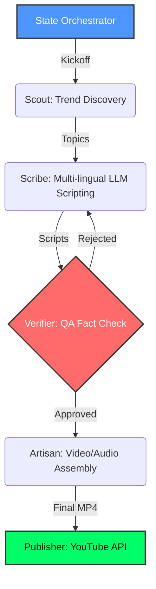

# Youtube-Automation-Project
The Youtube-Content Factory is an Enterprise level autonomous, multi-agent video production pipeline designed to transform raw news and data into high-quality, social-media-ready video content. Originally built to optimize rendering on legacy hardware , the system has evolved into a sophisticated "Digital Newsroom" that orchestrates specialized AI agents to handle the entire content lifecycle—from initial trend discovery to final video assembly.

## 📊 Architectural Workflow & System Topology

Core Architecture: The Multi-Agent Newsroom
Unlike traditional linear scripts, OSCF v2.0 utilizes a State-Driven Orchestration model. Each stage of production is managed by a dedicated agent with a specific "job description":

The Scout (Intelligence): Scans global news, GitHub repositories, and trending topics to identify high-impact content opportunities.

The Scribe (Creative): Utilizes Large Language Models (LLM) to draft engaging, context-aware scripts in multiple languages, including specialized Urdu Nastaleeq support.

The Verifier (QA): Acts as a technical fact-checker, cross-referencing claims against live data to ensure accuracy before production begins.

The Artisan (Production): The heavy lifter. It manages the hardware-accelerated rendering engine, combining audio, text-scrolling, and visual overlays.

The Governor (Resource Manager): A unique hardware-aware layer that monitors system thermals and CPU availability, dynamically switching encoders (e.g., Apple videotoolbox vs. libx264) to ensure stability on any machine.

Key Technical Innovations
Hybrid Voice Integration: Supports a dual-stream audio pipeline allowing for seamless switching between high-fidelity AI Text-to-Speech and human-recorded voiceovers with automated gain normalization.

Hardware-Aware Profiling: Automatically detects system specs to optimize rendering parameters, making high-quality video production possible on older dual-core processors.

Fault-Tolerant Pipeline: Employs a JSON-based "Project State" ledger that allows the system to checkpoint progress and resume from any stage in the event of a crash or interruption.

Dynamic Visual Overlays: Features a specialized engine for rendering syntax-highlighted code snippets and Urdu typography, synchronized perfectly to audio duration.

Technical Stack
Language: Python 3.x

Orchestration: Custom State-Machine Logic

Video Engine: FFmpeg & MoviePy (MLT Framework compatible)

AI Integration: Google Gemini (Scripting), Grok (Verification), ElevenLabs (TTS)

Security: Local AES encryption for API credential management

---

## ⚖️ Open-Source Academic Licensing & Disclaimer
This project is open-sourced under the terms of the standard **MIT License**. It is an architectural Proof of Concept (PoC) engineered strictly for local environment evaluation, educational research, and technical sandbox testing.
* **Operational Immunity:** This software is provided "as is", without warranty of any kind. ABT PLUS LLC (Automated Business Technologies) assumes zero liability, tracking obligation, or financial tracing responsibility for how third-party actors configure, clone, or deploy this script framework.
* **Compliance Boundary:** Users bear sole individual responsibility for ensuring that all data extraction loops, automation streams, or third-party API keys (e.g., Twilio, Deepgram, Gemini) linked to this code comply with regional laws (GDPR, CCPA), telecom carrier standards, and target infrastructure Terms of Service (ToS).

---

## 📬 Contact & Corporate Information
| | |
| --- | --- |
| **Organization** | ABT PLUS LLC (Automated Business Technologies) |
| **Website** | [www.abtplusllc.com](https://www.abtplusllc.com) |
| **Support** | [support@abtplusllc.com](mailto:support@abtplusllc.com) |
| **License** | MIT — Open Source |
